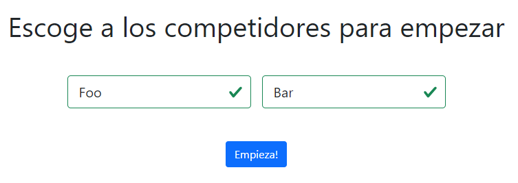
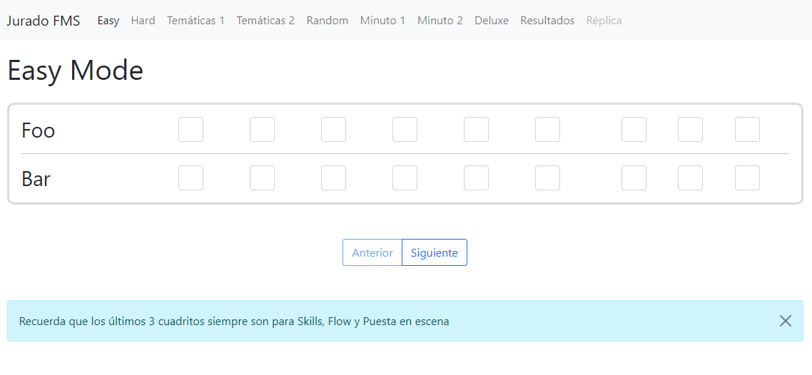
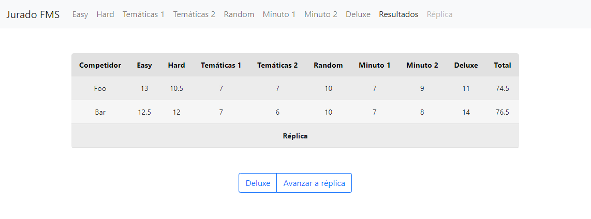
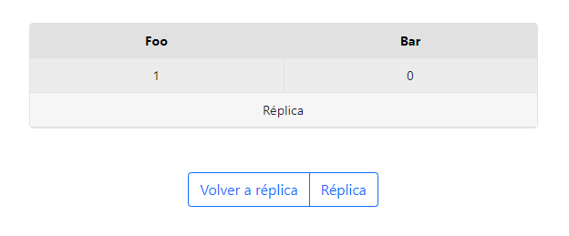
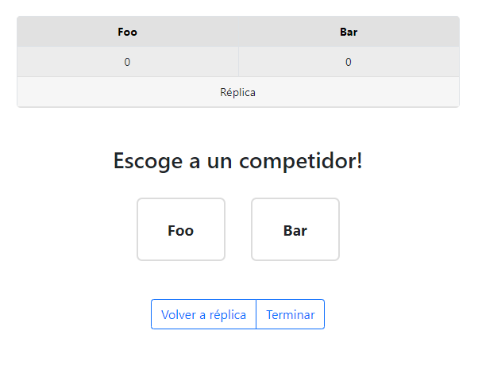

<h1 align="center">Jurado FMS - Voting web app for FMS</h1>

Jurado FMS is a web application developed using Django in the backend and TypeScript on the front end. It is made by me to other Spanish speakers rap fanatics that want to enjoy the beauty of scoring their favorite rap battles in the world-wide known format (by Hispanic people) of the rap league Freestyle Master Series (FMS).

## Table of Contents
+ [The app](#the-app-(how-it-works))
+ [Tecnologies used](#technologies-used)
+ [Contributions](#contributions)
+ [Running the site](#installation-and-running)

## The app (how it works)
To start voting, type in the names of the 2 competitors that will be battling, for example, 'Foo' and 'Bar'. These names have to meet certain requierements:
1. They have to be minimum 2 characters long. 
2. They have to be maximun 20 characters long.
3. They can't be named the word 'replica' nor 'Réplica'.

Then, just click the button that says 'Empieza!'.



<br>

Then, you will be presented with a poll. There will be a poll for each mode. The modes will be presented in the navbar. Each little square is an input that will take numbers from 0 to 4. They can have a .5 for a decimal, so `0.5`, `1.5`, `2.5`, `3.5`. These values are the calification you give to each of the rhymes. The last 3 inputs will always be "extra points" for the whole minute, that represent Skills, Flow, and Puesta en Escena (or hand gestures, movement, and that sort of things that competitors may do to improve their minute.)



<br>

When you finish filling the modes, you will see a table showing you the sum of all the points of the modes for each competitor, and it's total. If one of the competitors has more than 5 points, it will be declared the winner. Otherwise, it will be declared a 'Réplica' (that is why you can't have that word as a name.) To show all the features of the application, my poll was made a Réplica intentionally.



<br>

A replica is just like any other mode, but when you complete it, you will be presented with a different table. This time, you will only see the points of the replica, for those are the only points that count, and the difference to win will be `1.5`.



<br>

If you have another replica, you will just go to the replica mode again, and fill it. The difference is that this time, if you have another replica (not more than 1 point of difference,) you will be presented with two choices, one for each competitor, and you will decide who wins. After clicking on one of the choices, just click on 'Terminar', and the page will reload, ending your poll.



<br>

In the case that you didn't got replica in any of the steps before, you would just click 'Terminar' and it would save your poll and reload the page.

And that is it. You just voted an FMS rap battle. Hope you didn't made a tongo!

## Technologies used
In the back-end, there is a lot installed. You can find the dependecies of this project in [requirements.txt](./requirements.txt). I will explain what each module does. `Django` is the backend framework. `setuptools` is a dependency for `graphene-django`, that is used to create an API with GraphQL. For the database system, I used PostgresQL, and for that `psycopg2-binary` is necesary. For testing, I used `selenium`. And for deploy, I used [Heroku](https://heroku.com), which needs `gunicorn` and `django-heroku`.

In the front-end, I used TypeScript, SCSS, and Bootstrap.

## Contributions
Jurado FMS is open to contributions. If you want to contribute with an issue, first open one to let me know if I am not working on that myself. That way, we don't overwrite each other.  
If you want to contribute with a simple bug, like a typo or a broken link, just use the GitHub inline editor.

## Installation and running
Steps bellow:
```
# Clone the repo
git clone https://github.com/jnegrete2005/JuradoFMS.git

# Intall requirements
pip install -r requirements.txt
```

Then, add env vars called `SECRET_KEY` with the secret key you want, `DJANGO_DEBUG` with a value of 'True', and because I used Postgres as the databse system, add `POSTGRES_USER` with your postgres username, and `POSTGRES_PASSWORD` with your postgres password.

You'll need to have Postgres installed for the next steps:
```
psql postgres

> CREATE DATABASE juradofms;
> \connect juradofms;
> \q

# Migrate
python manage.py migrate

# Run the server
python manage.py runserver
```
